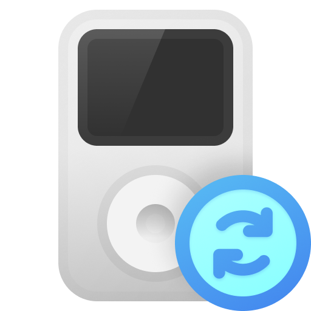

<div align="center">



# Classick

Sync a FLAC library to an iPod Classic on Windows.

[](#status)
[]()
[]()
[]()
[](crates/classick/Cargo.toml)

</div>

---

Classick wraps libgpod, transcodes FLAC to ALAC on the way over, and runs from the system tray.

## Status

Routine syncs work end-to-end through the tray app: device detection, plan review, transcode, write, manifest. Not every iPod Classic variant has been tested, and the corners (artwork edge cases, very large libraries, mid-sync USB unplug recovery) still occasionally surprise me. Don't point it at music you can't replace.

## What's in here

- `crates/classick/` — Rust core. One binary that runs as a CLI, an IPC subprocess, or a long-lived daemon.
- `ui/windows/` — WinUI 3 / .NET 10 tray app. Owns the daemon, surfaces device state and sync progress, hosts the first-run wizard.
- `docs/` — IPC wire format, design specs, SCSI notes.

The two halves talk over a named pipe (`\\.\pipe\classick`). Wire format lives in `docs/ipc-protocol.md`.

## Build

You'll need Rust stable on MSVC, MSYS2 at `C:\msys64` for the GLib headers libgpod's bindgen pass needs, and the .NET 10 SDK for the tray app.

```powershell
cargo build --release
cd ui\windows
dotnet build Classick.UI.slnx -c Debug
```

The csproj copies `target\release\classick.exe` and the libgpod DLLs next to `Classick.UI.exe` at build time. Skip the cargo step and you'll get a warning, not a build failure.

## More

- `AGENTS.md` — orientation for anyone working in this repo, human or agent.
- `docs/SPEC.md` — original design, rejected alternatives, FFI rationale.
- `LEARNINGS.md` — incidents and gotchas. Read before touching iTunes-DB code.
